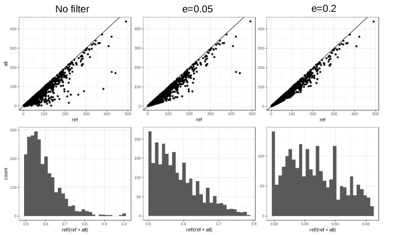

# Hybrid Scan

This Snakemake pipeline is meant to run hybrid scans (as described in [this paper](https://www.biorxiv.org/content/10.1101/2021.09.03.458849v1)) on diploid individuals. It takes raw sequencing data as input, in which case the running steps will be as follows:

1. read filtering (fastp)
2. assembly (megahit)
3. extraction of contigs of interest: UCEs (phyluce) or busco genes (busco) 
4. read alignement to contigs (bwa-mem2) 
5. per-contig counts of heterozygous sites (angsd or via snp-calling with freebayes) 
6. optional filter for contamination (possible only with the snp-calling variant)
7. divergence estimation (custom R files; see article)

The pipeline is designed so that the user may provide any intermediate files (e.g., bam files) and run only later steps, in the Snakemake fashion. The user should be familiar with this program. 

# Quick setup

To set the pipeline up after downloading the repo, just cd to its root and run:

```
./setup.sh
```

Provided conda and mamba are installed, this script will create necessary conda environments. After this, load the main environment with:

```
conda activate hybscan_env
```

Once the environment is loaded, the pipeline can be controlled using standard Snakemake commands. For instance, you should begin with a dry-run to check that everything is in order:

```
snakemake -n 
``` 

# Details

## Data directory
 
When running setup.sh, the script will ask you for a preferred data directory, which should contain input files, and will contain all output files. This directory can always be changed by editing variable DATADIR in the Snakefile. This is so (potentially heavy) data files can be confined to a suitable volume. 

## Environments

Some simple tool-specific conda environments are created by setup.sh besides hybscan_env. The yaml files describing these environments are in tools/config. If needed, any environment can be reconstructed individually using 

```
tools/config/mamba_setup.sh path/to/file.yaml
```

## Pipeline control

Snakemake works by requiring target (output) files. As is usual, required targets (file paths) are described in the rule 'all' within the Snakefile. This Snakefile here constructs target file paths for each id present as a key in one of two python dictionaries: UCEDIC (ids to analyze with phyluce) and BUSCODIC (ids to analyse with busco). In turn, these dictionary can be constructed manually (for small runs; see top of the Snakefile) or automatically from description files (useful for large runs with many ids).

Dictionaries are used to associate parameters to each id. For instance, phyluce needs to know which probes set to use for each id. This info is stored in the UCEDIC dictionary, which can be constructed from a description file such as uce\_list. In the same spirit, busco needs to know what database and what augustus species to use, and this information can be given in a file such as busco\_list. The paths to both description files are stored in variables UCETARGETS and BUSCOTARGETS in the Snakefile.

All in all, this setup should allow the user to control what individuals are analyzed (and how) by just editing uce\_list and busco\_list. One can also use other files by editing the path to description files (UCETARGETS and BUSCOTARGETS) in the Snakefile. To shut off entire parts of the pipeline, the user may either provide empty description files or modify the rule 'all' directly (e.g., commenting out some targets). 


## Filepath format

The pipeline is designed so that each rule adds a specific and unique part to the extension of its output, while preserving that of its input. For instance, running phyluce to extract UCEs from a de-novo assembly named `mysample.any.extension.fasta` will give a new fasta named `mysample.any.extension.phyluce.fasta` that contains identified UCE sequences only. 

This makes the steps involved in producing a given file explicit. It also makes it easier to require a given series of steps. For instance, one can require the target `mysample.fastp.megahit.phyluce.bwa.fastp.angsd.divestim.txt`to run the full pipeline in its phyluce+ANGSD version.

Some rules have a particular behavior regarding the extension they produce. 

1. Read alignment with bwa-mem2 will produce an extension of the form `.bwa + fastq_ext` where fastq_ext is the extension of the fastq file(s) that was aligned. This is so one can align any type of reads (e.g. filtered or not). For instance, in the example above, bwa was used to aligned filtered reads (mysample\_*.fastp.fastq.gz) to UCE sequences stored in `mysample.fastp.megahit.phyluce.fasta`.
2. The contamination filter step adds its main parameter (see Contamination filter section) to its output's extension. This is to allow the user to easily run contamination filters with different values and compare. 


## Input files

All input files should be in DATADIR. Raw read files should have the format `sampleid\_\[12\].fastq.gz` (paired-end data) or `sampleid.fastq.gz` (single-end data). The user can provide any combination of pe and se data (any or both). The pipeline should automatically detect what types were provided and all available reads will be used in the assembly and alignment steps. This is why some rules have pe, se and pe+se variants.

If needed the script tools/scripts/SRRdownload.sh can help you download data from genbank using fasterq-dump. For instance, for testing you may want to download raw read data for ids in the example description files:

```
tools/scripts/SRRdownload.sh uce_list path/to/write/fastq/to
tools/scripts/SRRdownload.sh busco_list path/to/write/fastq/to
```

## Parameters

Parameters for each tool in the pipeline can be set at the top of the Snakemake in the variables of form \*\*\*_OPT. Just make sure that any parameter you set is compatible with what is hard-coded in the corresponding rule's body. 

Variables of the form \*\*\*_THREADS can be used to set the number of threads/cores allocated for each call to a given tool.


## PHYLUCE or BUSCO?

This is mostly up to the user. Using BUSCO is much better when busco genes can be recovered (e.g. complete genomes or transcriptomes), as it yields less variable estimates of heterozygosity.

## ANGSD or SNP calling?

ANGSD is fast and properly takes sequencing depth and error into account when estimating heterozygosity. However, it cannot identify contamination. The SNP calling variant was more recently developed to filter contamination as much as possible, but introduces other sources of error in heterozygosity estimations, as it uses a user-defined threshold to filter out the shadiest heterozygous sites. 

## Contamination filter

The \'contamination filter\' works by filtering SNP that are not consistent with true heterozygosity, using REF and ALT allelic depth as given in a vcf file. For each SNP, two probabilities are calculated:

1. The probability that a site is a true heterozygous site. This the probability to observe ALT alternative alleles under the hypothesis that the true frequency of the alternative allele is 0.5. That is computed using the mass function of a binomial law with n=ALT+REF=(total depth), k=ALT and p=0.5.
2. The probability that a site is a true homozygous site, but with some alternative alleles due to sequencing error and contamination. This is the probability to observe ALT alternative alleles under the hypothesis that the true frequency of the alternative allele is less than 0.5. That is computed using the mass function of a binomial law with n=ALT+REF=(total depth), k=ALT and p=e\<0.5.

Then, if the second probability is larger than the first, the SNP is discarded. 

The parameter e, which represents the expected frequency of alternative alleles at true homozygous sites (given error and contamination) cannot be set objectively and has to be user-defined. The larger the value of e, the harder the filter. It is perhaps best to test different values and to assess the sensibility of divergence estimations to this parameter. 

The following plot is an example of the effect of the filter with values 0.05 and 0.2. Such plots can be obtained using the pipeline (see rule all in Snakefile).



## Divergence estimation

Divergence estimations are carried out by fitting the model described in the article, using r-stan and custom R scripts. For each analysis, the output of this estimation is given in two files.

1. `mysample.some.extension.divposterior.txt` gives the actual parameter values sampled across all iterations (excuding warm-up) and all chains. It can be used to reconstruct or manipulate posterior distributions precisely.
2. `mysample.some.extension.divestim.txt` a summary of the results, with the following fields:
    * file: Path to the input file
    * nb_loc: The number of contigs used for estimations (number of lines in input file)
    * He\_mean: Mean heterozygosity across contigs
    * He\_var: variance of heterozygosity across contigs
    * stan\_\*\*\*\_mean: mean posterior value of parameter \*\*\* (gamma, theta or gamma/theta ratio)
    * stan\_\*\*\*\_se\_mean: standard error on mean posterior value
    * stan\_\*\*\*\_sd: standard deviation in posterior distribution of parameter \*\*\* (gamma, theta or gamma/theta ratio)
    * stan\_\*\*\*\_q%: q% quantile in posterior distribution of parameter \*\*\* (gamma, theta or gamma/theta ratio)
    * stan\_\*\*\*\_n\_eff: effective sample size across chains, see stan documentation.
    * stan\_\*\*\*\_Rhat: R-hat convergence diagnostic, see stan documentation

## Gathering results

If you want to gather result summaries for many samples analyzed in the same way (with the same total extension) just require `alluce.some.clever.extension.divestim.gathered.txt` (for UCEs) or `allbusco.some.clever.extension.divestim.gathered.txt`(for busco)


